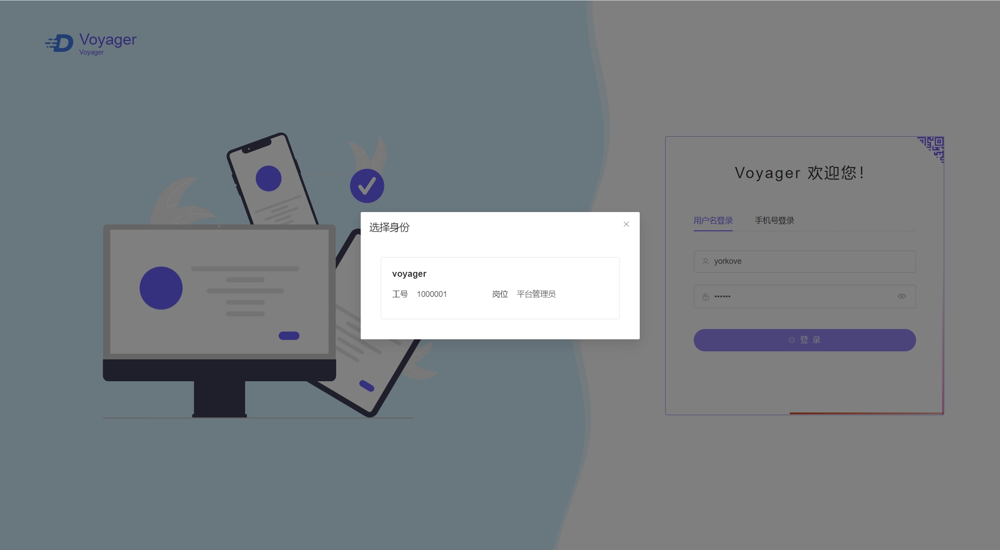
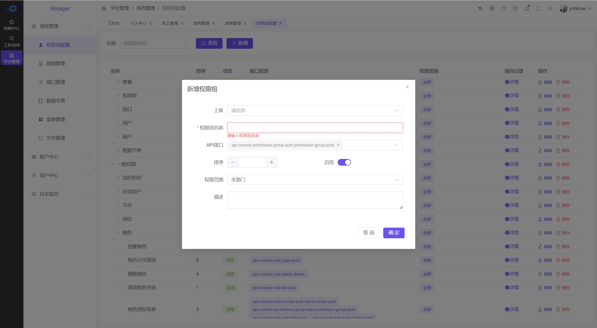
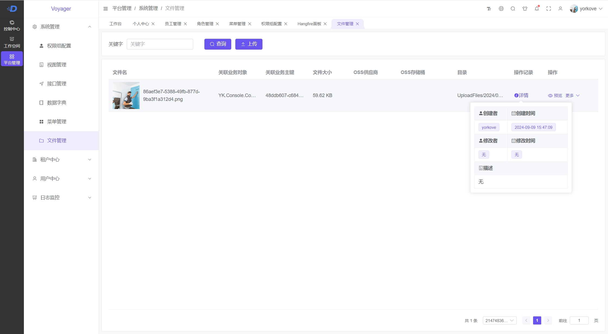
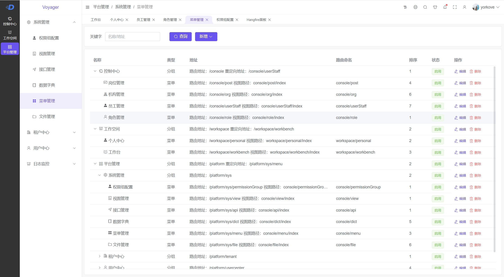
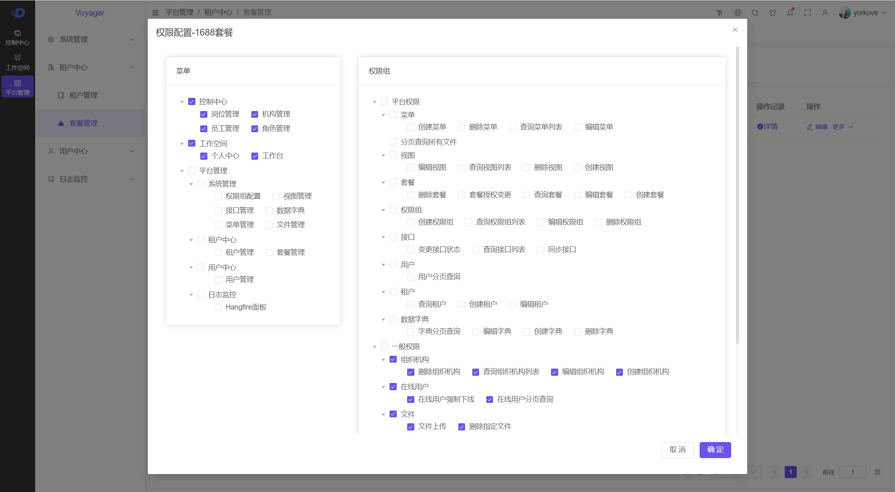
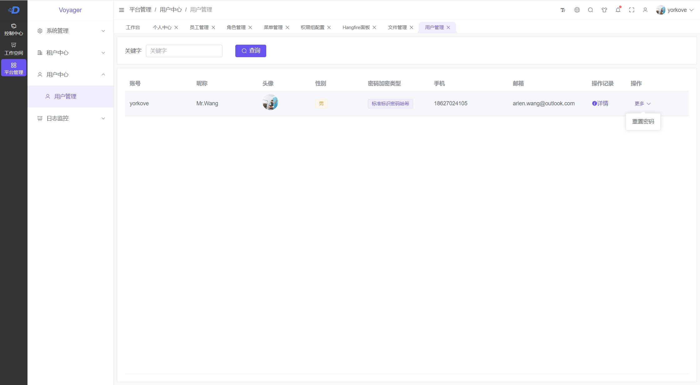
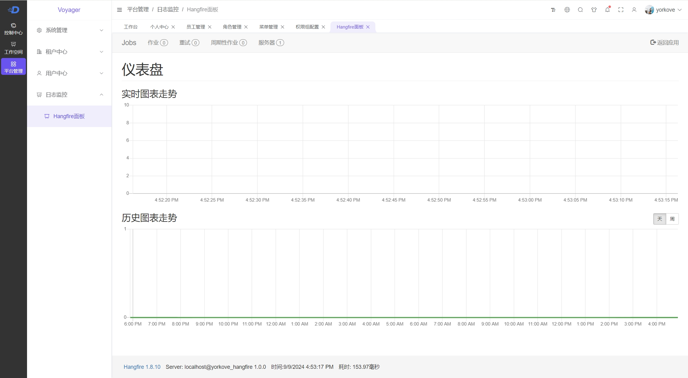
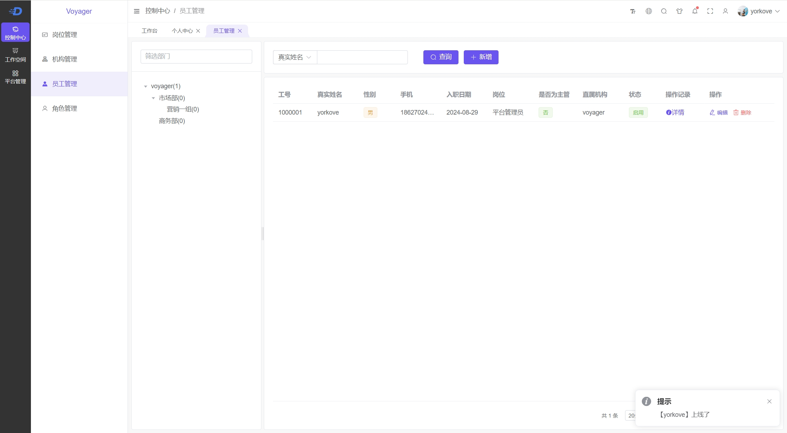
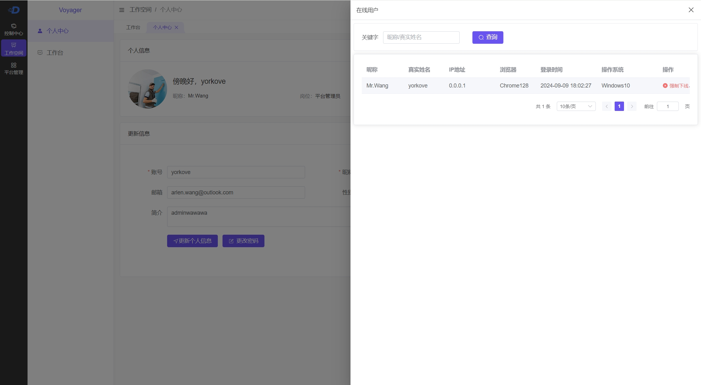

# YorkoveVoyager

### 介绍

基于.Net8+JWT+EF8+MediatR+Serilog+Hangfire+Redis等技术栈构建的整洁架构多模块Api解决方案

### 当前功能
1. 接口管理：自动同步Swagger的接口数据
2. 权限组配置：将多个接口打包为一个权限组，并对当前权限组分配数据权限范围
3. 视图管理：管理视图页面组件
4. 菜单管理：管理菜单，菜单绑定视图页面
5. 文件管理：管理平台内所有上传到本地或者OSS对象存储的文件
6. 数据字典：管理平台定义的数据字典
7. 套餐管理：将菜单与权限组打包创建套餐
8. 租户管理：创建租户，为租户赋予套餐
9. 日志：* 建议搭建 ES+Kibana 的日志分析环境，这里只做链接引用
10. Hangfire：平台对后台任务的管理仍需完善，目前通过Hangfire面板查看
11. 用户管理：管理平台中的所有用户
12. 岗位管理：对当前租户的岗位进行管理
13. 角色管理：将菜单与权限组打包赋予角色
14. 机构管理：对当前租户的所有机构进行管理
15. 员工管理：平台中一个用户可在不同租户中的就职身份信息，同一个租户中一个用户只能有一个在职的就职身份信息
16. 在线用户：基于SignalR集线器，呈现平台当前登录的在线用户，可强制踢出登录的某个用户
17. 地区管理：同步国家统计局地域信息
18. 系统内身份切换： 登录到系统后，用户仍可选择切换到其他租户所属机构的就职身份 - 进行中


### 开始
 - 拉取代码后新建项目请参考 YK.Console 或 YK.CRM 模块

### 运行
 - 项目运行前需要修改 YK.Host/Configs 配置目录中的数据库连接字符串，包括 database.json 与 hangfire.json(Storage节点)
 - 若修改实体类，则在修改后需要执行EF的Migration迁移命令，首先选中YK.Host项目，右键在终端中打开，通过执行以下命令进行迁移:

```
--dotnet ef migrations add <CommitMessage> --project ../YG.Migrators.<DBProvider>/ -c <业务库上下文> -o <输出至目录>

dotnet ef migrations add Hello --project ../YG.Migrators.MySQL/ -c ConsoleDbContext -o Console

```
> 执行 dotnet ef migrations 如果报错不能识别命令则需要先安装dotnet ef

### 预览



> 选择登录身份 [当只有一个就职身份信息时，后续调整为默认不需要选择身份]



> 权限组配置



> 文件管理



> 菜单管理



> 套餐管理



> 用户管理



> hangfire面板



> 员工管理



> 在线用户


### 参与贡献

1.  Fork 本仓库
2.  新建 Feat_xxx 分支
3.  提交代码
4.  新建 Pull Request


### 特技

1.  使用 Readme\_XXX.md 来支持不同的语言，例如 Readme\_en.md, Readme\_zh.md
2.  Gitee 官方博客 [blog.gitee.com](https://blog.gitee.com)
3.  你可以 [https://gitee.com/explore](https://gitee.com/explore) 这个地址来了解 Gitee 上的优秀开源项目
4.  [GVP](https://gitee.com/gvp) 全称是 Gitee 最有价值开源项目，是综合评定出的优秀开源项目
5.  Gitee 官方提供的使用手册 [https://gitee.com/help](https://gitee.com/help)
6.  Gitee 封面人物是一档用来展示 Gitee 会员风采的栏目 [https://gitee.com/gitee-stars/](https://gitee.com/gitee-stars/)
